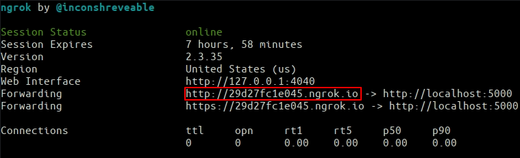
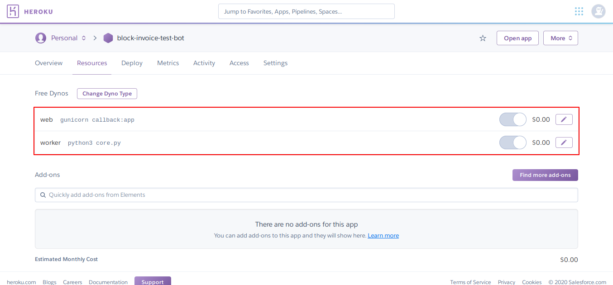

# greed

A customizable Telegram shop bot that accepts bitcoin payments. Demo at https://t.me/TgShopDemoBot


## Requirements

* [Python 3.6 (or higher)](https://www.python.org/)
* The packages specified in `requirements.txt` (install with `pip3 install -r requirements.txt`)
* An Internet connection
* A Telegram bot token (obtainable at [@Botfather](https://t.me/Botfather))
* A payment provider token (obtainable by [connecting a provider with your bot](https://t.me/Botfather))
* _Optional: a [git client](https://git-scm.com/)_
* _Optional: a [sentry.io](https://sentry.io) token_

## Installation

1. Download the project files through `git clone https://github.com/DarrenWestwood/greed.git` or [this link](https://github.com/DarrenWestwood/greed/archive/master.zip).
2. Install the project requirements with `pip3 install -r requirements.txt`
3. _Optional: run `pip3 install coloredlogs` to have colored logging output._
3. Run `python3 -OO core.py` to generate the configuration file.
4. Open the config folder and edit the `config.ini` file following the contained instructions.  
   - Ensure the `is_template` field is set to `no`.
   - Select your preferred language, example `language = en_US`.
   - Set your Telegram bot token obtained from the Telegram [Botfather](https://t.me/Botfather).
5. Run `python3 -OO database.py` to generate the database tables. 
6. _Optional: customize the `strings.py` file_
7. Run `python3 -OO core.py` again to run the bot.
8. Open Telegram, and send a `/start` command to your bot to be promoted to administrator.

## Usage

All the bot features are available through Telegram.
As the administrator, you can add new products, check the placed orders, create new transactions and generate .csv log files.  
Users will be able to add credit to their wallet, place orders and contact you in case they require assistance.

## Updating

### Through `git`

If you downloaded `greed` through `git`, you can update it by running:

```
git stash
git pull
git stash pop
```

### By redownloading the zip file

If you downloaded `greed` through the zip archive, you can update it by redownloading [the latest version](https://github.com/DarrenWestwood/greed/archive/master.zip) and by moving your `config.ini` and `database.sqlite` (if applicable) files to the new folder.

## Integrating Bitcoin

1. You will require a Blockonomics API Key - Complete merchant setup wizard by clicking on Get Started for Free on [Blockonomics Merchants Page](https://www.blockonomics.co/merchants#/).

2. Edit the config.ini file to set your Blockonomics api_key 

3. Set the HTTP Callback URL on the Blockonomics Merchants Page

	Below are instructions on how to deploy your bot to obtain a Callback URL for your bot using ngrok or Heroku.

	### Deploy using ngrok
	* In a new terminal/cmd prompt run `python3 -OO callback.py` to run the bitcoin callback listener.
	* Download ngrok and follow the setup instructions: https://ngrok.com/download
	* In a separate terminal/cmd prompt run ngrok on the same port as the callback `./ngrok http 5000` or `~/ngrok http 5000`
	* Copy the Forwarding URL from ngrok.
	 
	* To set the HTTP Callback URL on the Blockonomics Merchants Page, combine the Forwarding URL with `/callback?secret=YOUR_SECRET` 
	   eg.  http://c7f7ecb92ht5.ngrok.io/callback?secret=YOUR_SECRET
	* Run `python3 -OO core.py` again to relaunch the bot.

	### Deploy using Heroku
	* Test using heroku cli command: `heroku local`
	* You will also be able to login to heroku and push your bot to heroku master to launch it into production using the following commands:
	```
	git init .
	git add .
	git commit -m "Deploy to Heroku"
	heroku login -i
	heroku git:remote -a {your-heroku-project-name}
	git push heroku master
	```
	* You can now start the greed bot and blockonomics callback from the Heroku Dashboard > Resources.
	 
	* To set the HTTP Callback URL on the Blockonomics Merchants Page, combine the Heroku App URL with `/callback?secret=YOUR_SECRET`
		eg. https://greed.herokuapp.com/callback?secret=YOUR_SECRET

## Credits
This project is a fork of [greed project](https://github.com/Steffo99/greed) by @Steffo99. We would like to thank @Steffo99 for putting this in public domain. 
